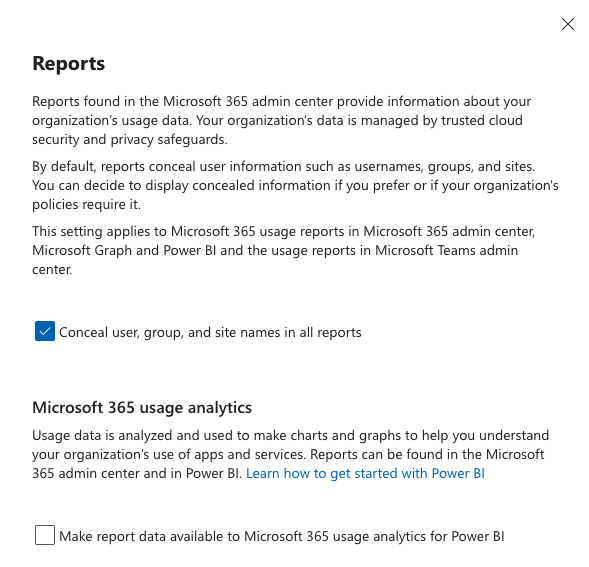
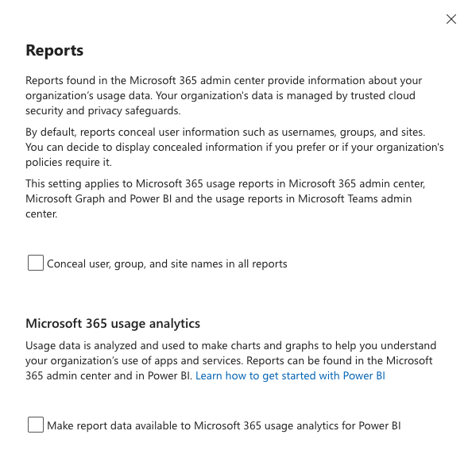

# ServerBridge License Scan — free Microsoft 365 unused-license scan

**See, in dollars, the Microsoft 365 licenses you pay for that nobody uses — in five minutes, read-only.**

```powershell
Install-Module ServerBridge.LicenseScan -Scope CurrentUser
Invoke-LicenseScan
```

No app registration. No agent. Nothing stored. It never changes anything in your tenant.

> This is the free community scan. The paid **[ServerBridge License Auditor](https://server-bridge.com/license-auditor.html)**
> adds a PDF report, costed recommended actions and scheduled re-audits.

## What it checks

1. Reads your subscribed licenses (SKUs) and who each one is assigned to.
2. Looks up each licensed user's last activity:
   - **directory sign-in activity** if your tenant has Microsoft Entra ID P1 or P2, or
   - **Microsoft 365 usage reports** if it doesn't (no premium license needed).
3. Flags as dormant:
   - accounts with no activity in the last **90 days** (change with `-InactiveDays`), and
   - **disabled accounts that still hold a paid license**. This check works on every tenant.
4. Prices the dormant seats and prints wasted spend by license, then saves a per-user CSV.

```
Wasted spend by license
-----------------------

License        DormantSeats Annual $
-------        ------------ --------
ENTERPRISEPACK           12     5184
SPE_E5                    3     2052
POWER_BI_PRO              6      720

  Reclaimable seats : 21
  Wasted spend      : $7,956 / year
```

Free licenses (Teams Exploratory, Power Automate Free and similar) are skipped. Guest accounts
are skipped unless you add `-IncludeGuests`.

## Requirements

- **Windows PowerShell 5.1** or **PowerShell 7+** on Windows, macOS or Linux.
- A Microsoft 365 account that can read the directory. **Global Reader** is enough to run it.
- The first time anyone in your tenant runs it, a **Global Administrator** (or another role that
  can grant admin consent) has to approve the permissions below.

`Install-Module` also installs the three Microsoft Graph modules the scan needs
(`Microsoft.Graph.Authentication`, `Microsoft.Graph.Users`,
`Microsoft.Graph.Identity.DirectoryManagement`).

## Permissions it asks for, and why

Sign-in uses Microsoft's own **Microsoft Graph Command Line Tools** app with a device code. Every
permission is **delegated** (it acts as you) and **read-only**:

| Permission | Why the scan needs it |
|---|---|
| `User.Read.All` | List licensed users, their licenses and whether each account is enabled |
| `Organization.Read.All` | Read your tenant name and the licenses you subscribe to |
| `AuditLog.Read.All` | Read last sign-in dates (tenants with Entra ID P1/P2) |
| `Reports.Read.All` | Read Microsoft 365 usage activity (tenants without P1) |

It never asks for write permissions and never reads mail, files or chats. The sign-in is held in
memory for the run only and is signed out at the end.

## Options

```powershell
Invoke-LicenseScan -InactiveDays 60                 # tighter dormancy window (1-3650 days)
Invoke-LicenseScan -IncludeGuests                   # also score guest accounts
Invoke-LicenseScan -OutputCsv C:\reports\waste.csv  # choose where the CSV goes
Invoke-LicenseScan -PassThru | Sort-Object AnnualCost -Descending   # get the rows as objects
```

By default the CSV is saved to the current folder as `license-scan_<tenant>_<date>.csv`. It is only
written when the scan finds something.

**Prices are list-price estimates** in USD per user per month, so you get a dollar figure out of the
box. Unknown SKUs are priced at $20. For exact figures, edit the price table near the top of
`Invoke-LicenseScan.ps1` to match your contract.

To update later: `Update-Module ServerBridge.LicenseScan`

## FAQ

### "Running scripts is disabled on this system"

Windows desktops block PowerShell scripts by default. To allow them for this window only:

```powershell
Set-ExecutionPolicy -Scope Process -ExecutionPolicy RemoteSigned
Invoke-LicenseScan
```

Closing the window puts the policy back. Every file in the module is signed by
Lee Crowe Software Solutions LLC (see [Verifying the signature](#verifying-the-signature)).

### Install-Module asks about NuGet or an "untrusted repository"

These are normal the first time you install anything from the PowerShell Gallery. Answer **Yes**
to installing the NuGet provider and **Yes** to installing from PSGallery.

### Does it work with MFA?

Yes. You sign in with a device code in your browser, so MFA, passkeys and authenticator prompts
work as usual. If your tenant's Conditional Access blocks **device code flow**, sign-in fails. In
that case, ask whoever manages Conditional Access to allow it for your account while you run the
scan.

### We don't have Entra ID P1. Will it still work?

Yes. Sign-in dates need Entra ID P1, so without it the scan switches to Microsoft 365 usage
reports automatically and tells you it did. Usage reports show the last time someone actually used
Exchange, OneDrive, SharePoint or Teams, which is often a better answer than a sign-in date anyway.
Microsoft only keeps 30, 90 or 180 days of report history, so the scan pulls the smallest window that
covers `-InactiveDays` (anything over 180 uses 180).

### It says Microsoft is hiding user names in the reports

Microsoft hides user names in usage reports by default, and many tenants never change that. Without
names, the scan can't tell who is inactive. It stops, shows you how to fix it, and waits:

1. Open the [Reports settings in the Microsoft 365 admin center](https://admin.microsoft.com/#/Settings/Services/:/Settings/L1/Reports)
   (or go to **Settings → Org settings → Services → Reports**). You need to be a Global Administrator.
2. Untick **Conceal user, group, and site names in all reports**.
3. Click **Save**, go back to the scan and press **Enter**.

| Before (Microsoft's default) | After step 2 |
|---|---|
|  |  |

The scan checks again with the same sign-in, so you don't have to sign in again. Microsoft can take a
few minutes to apply the change; if names are still hidden, the scan says so and you can press Enter
again. Type **S** to skip. The scan then checks only disabled accounts that still hold licenses and
labels the result **PARTIAL AUDIT**.

This setting only changes what admins see in Microsoft's own reports. You can turn it back on after
the scan.

### Which account is it scanning?

Right after sign-in it prints `Connected to: <tenant> (signed in as <account>)`. If that's the wrong
tenant, press Ctrl+C and run it again with the right account.

### Can I run it without installing a module?

Yes. Download the signed `Invoke-LicenseScan.ps1` from the
[latest release](https://github.com/lbcrowe-del/ServerBridge-LicenseScan/releases/latest), install
the Graph SDK (`Install-Module Microsoft.Graph -Scope CurrentUser`) and run `./Invoke-LicenseScan.ps1`
with the same options. Windows may ask whether to run software from this publisher. Choose
**Run once** or **Always run**.

## Privacy and safety

- **Read-only.** It never assigns, removes or changes licenses, users or settings.
- **Nothing leaves your machine** except the calls to Microsoft Graph. No telemetry and no upload.
  The only output is the CSV.
- **Readable.** The scan is one open-source PowerShell file. Read it before you run it.

See [PRIVACY.md](PRIVACY.md) for the full data-handling statement.

## Verifying the signature

Releases are Authenticode-signed by Lee Crowe Software Solutions LLC through Azure Trusted Signing.
To check:

```powershell
Get-InstalledModule ServerBridge.LicenseScan | ForEach-Object {
    Get-ChildItem $_.InstalledLocation -Include *.ps1, *.psm1, *.psd1 -Recurse |
        Get-AuthenticodeSignature | Format-Table Status, Path
}
# Every Status should be 'Valid'
```

For the standalone script: `Get-AuthenticodeSignature ./Invoke-LicenseScan.ps1`

## When you outgrow the free scan

The free scan tells you *what's* wrong. The paid **[ServerBridge License Auditor](https://server-bridge.com/license-auditor.html)**
adds:

- a PDF report for management, with costed recommended actions
- unassigned licenses you're paying for, and free-trial seats shown separately
- scheduled re-audits that show what changed since the last one (Team)
- a multi-tenant roll-up for MSPs (Enterprise)
- support

## Changes

See [CHANGELOG.md](CHANGELOG.md).

## License

[MIT](LICENSE) © Lee Crowe Software Solutions LLC
